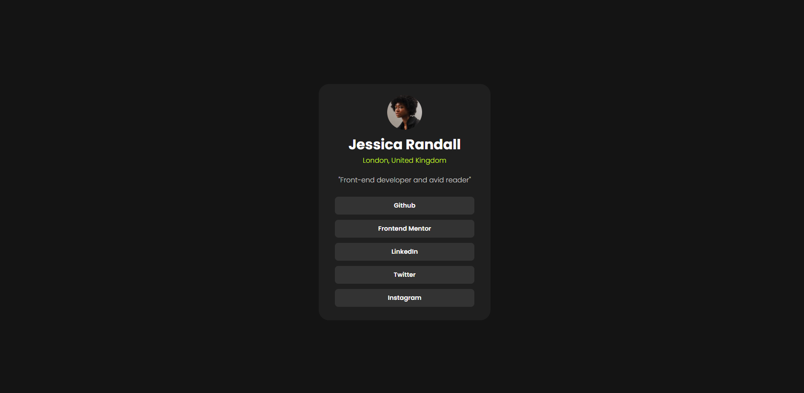

# Frontend Mentor - Social links profile solution

This is a solution to the [Social links profile challenge on Frontend Mentor](https://www.frontendmentor.io/challenges/social-links-profile-UG32l9m6dQ). Frontend Mentor challenges help you improve your coding skills by building realistic projects. 

### Screenshot

### Links

- Solution URL: [Click](https://id024.github.io/frontend-03)

### Built with

- Semantic HTML5 markup
- CSS custom properties
- Flexbox

### Continued development

Need to continue learning more about flex boxs and mainly how to use combinations

## Author

- Website - [Mr iD](https://www.your-site.com)
- Frontend Mentor - [@iD024](https://www.frontendmentor.io/profile/iD024)
